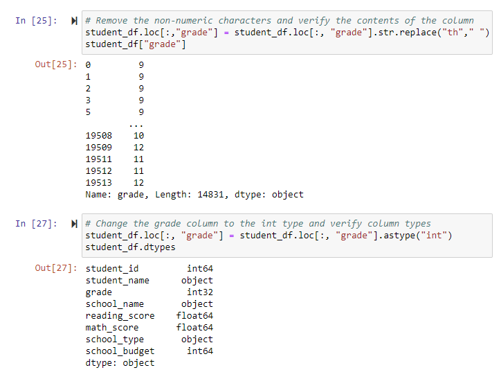
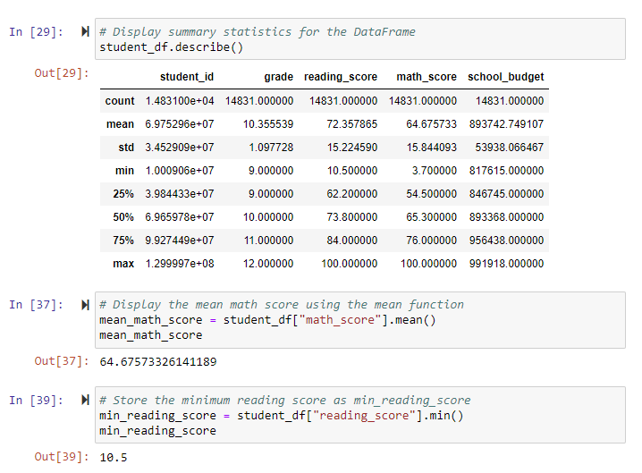
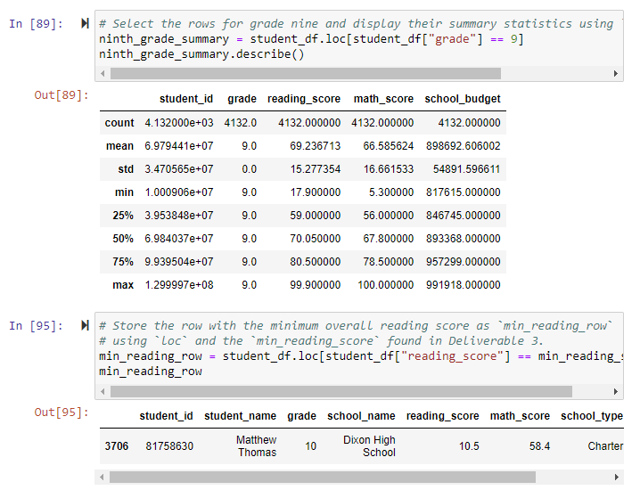
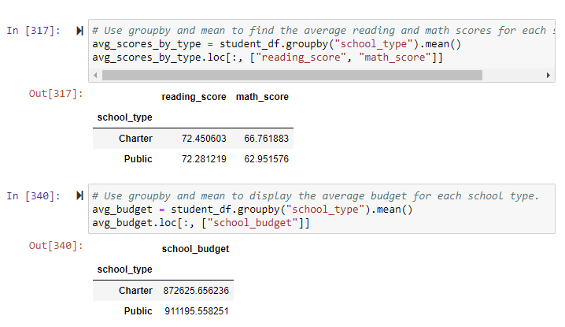

# School Data Analysis
## Overview of Project
My manager provided a data set that contains information about test scores and budgets for a list of high schools. Our task was to analyze student funding and student test scores based on grade levels and school types. Python code and Jupyter notebook were used to analyze the data. First, we imported the file into our jupyter notebook. We cleaned our data for "NaN" values, missing values, and duplicate values. Standarized the grade column by converting data from object to integer in order to drill down the data needed to be anaylized. 
### Prepare the Data
Data was prepared using the following functions:
- .sum()
- .dropna()
- .drop_duplicates()
- .dtypes
- .str.replace
- .astype

Dropped the "th" from grades and made change the type from "object" to "int"

### Summarize the Data
Data was summarized by using the following functions: 
- .describe()
- .mean()
- .min()

We were able to find the statistics for the DataFrame, the average test score, and the lowest test score.

### Drill Down into the Data
The following fuctions were used to drill down the data and get more specifics on a grade and a school.
- .iloc()
- .loc()

We were able to locate the statistics for 9th Grade and find which student had the lowest reading score.

### Comparisons Between Public and Charter Schools
The following functions were used to compare the two school types.
- .groupby()
- .mean()

We were able to find the school budget per school type and the average test scores per school type.

## Summary of Findings
When analyzing the overall average test scores for math and reading between Charter and Public Schools, the scores were comparable. But when broken down by grade level, the average test scores were lower in Public Schools than Charter Schools. Public Schools receive a bigger bugdget than Charter Schools. Another analysis that can be taken into account is, how many students per school type. This data will show that there are a total of 8,120 students in the Public School system and 6,711 students in the Charter School system. A conclusion we can draw from this information is, even though the budget is greater for Public Schools, Charter Schools have a higher budget per student.
